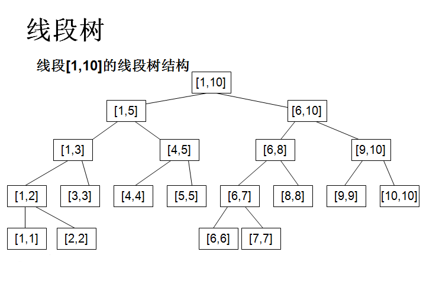

## hdu1166 敌兵布阵

题目链接：http://acm.hdu.edu.cn/showproblem.php?pid=1166

题目类型：线段树（高级数据结构）

题目大意：打仗，侦察敌情，敌军有n个工兵营地，每个里有一些人，而且还会不断进出，根据输入执行单点进出和区间统计操作，输出实时统计结果。

题目分析：典型的线段树，而且是最简单的一种，单点更新，区间统计。下面介绍线段树入门内容。

线段树（Segment Tree）入门：



1. 概述
   
   话不多说，先上图。上面这张图展示的是有10个元素的线段树结构，每个节点内的两个数分别是此节点记录的原数组左端点和右端点，还应该有一个求和域，图上没有画出来。
   
2. 建树
   
   建树操作是将整个数组的左右端点输入，从根节点开始递归分割，左右端点重合时在叶子节点结束，并在回溯时更新各节点的求和值。
   
3. 更新（单点）
   
   使用二叉查找树的查找功能，找到叶节点，更新之，回溯时更新各上层节点，一如建树。
   
4. 后续
   
   简单看了一下后面，进阶内容无非就是区间更新（整个区间所有点同时做一个相同的操作）和处理乘除开根操作。区间更新为维持效率，需要懒惰操作，每个点加懒惰标记，特定时候真正去更新，乘除和开根号还没看，估计也差不多。

```c++
#include<stdio.h>
const int maxn=50010;
struct node
{
    int l,r,sum;
}tree[4*maxn];
int input[maxn];
inline void build(int i,int l,int r){//递归建树
    tree[i].l=l;tree[i].r=r;
    if(l==r){//如果这个节点是叶子节点
        tree[i].sum=input[l];
        return ;
    }
    int mid=(l+r)>>1;
    build(i*2,l,mid);//分别构造左子树和右子树
    build(i*2+1,mid+1,r);
    tree[i].sum=tree[i*2].sum+tree[i*2+1].sum;//刚才我们发现的性质
    return ;
}
inline int search(int i,int l,int r){
    if(tree[i].l>=l && tree[i].r<=r)//如果这个区间被完全包括在目标区间里面，直接返回这个区间的值
        return tree[i].sum;
    if(tree[i].r<l || tree[i].l>r)  return 0;//如果这个区间和目标区间毫不相干，返回0
    int s=0;
    if(tree[i*2].r>=l)  s+=search(i*2,l,r);//如果这个区间的左儿子和目标区间又交集，那么搜索左儿子
    if(tree[i*2+1].l<=r)  s+=search(i*2+1,l,r);//如果这个区间的右儿子和目标区间又交集，那么搜索右儿子
    return s;
}
inline void add(int i,int dis,int k){
    if(tree[i].l==tree[i].r){//如果是叶子节点，那么说明找到了
        tree[i].sum+=k;
        return ;
    }
    if(dis<=tree[i*2].r)  add(i*2,dis,k);//在哪往哪跑
    else  add(i*2+1,dis,k);
    tree[i].sum=tree[i*2].sum+tree[i*2+1].sum;//返回更新
    return ;
}
int main()
{
    int t, n, x, y;
    char op[9];
    scanf("%d", &t);
    for(int ti=1;ti<=t;ti++) {
        scanf("%d", &n);
        for (int i = 1; i <= n; i++) scanf("%d", &input[i]);
        build(1, 1, n);
        printf("Case %d:\n", ti);
        while (true) {
            scanf("%s", &op);
            if (op[0] == 'E') break;
            scanf("%d%d", &x, &y);
            if (op[0] == 'A' || op[0] == 'S') {
                if (op[0] == 'S') y = - y;
                add(1, x, y);
            } else {
                printf("%d\n", search(1, x, y));
            }
        }
    }
    return 0;
}
```

PS：参考的https://www.cnblogs.com/jason2003/p/9676729.html 这篇，线段树进阶还可以看它。
