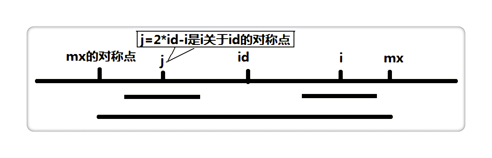

## hdu3068 最长回文

题目链接：http://acm.hdu.edu.cn/showproblem.php?pid=3068

题目类型：字符串，回文，manacher

题目大意：找最长回文子串

manacher算法：

  概述：这个算法是用来找一个字符串里最长回文子串的，如果使用暴力的方法来找，那么肯定是双for循环，把每个点当中点，再向两边遍历，复杂度O(n*n)。manacher虽然也要把每个点当中点遍历一遍，但每次无需从0半径开始扫描，而是把以一个点为中心的回文串长度与其它点的联系起来，做一个运算得到起始搜索长度，使得其复杂度骤降为O(n)
  
  |i|0|1|2|3|4|5|6|7|8|9|10|11|12|13|14|15|16|17|18|19|20|21|22|
  |:----:|----|----|----|----|----|----|----|----|----|----|----|----|----|----|----|----|----|----|----|----|----|----|----|
  |s_new[i]|$|#|a|#|b|#|b|#|a|#|h|#|o|#|p|#|x|#|p|#|o|#|^|
  |p[i]|1|1|2|1|2|5|2|1|2|1|2|1|2|1|2|1|6|1|2|1|2|1|1|
  
  步骤（大致分为“预处理；循环：{运算；搜索；}”）：
  
  1. 预处理：回文分奇回文（如abcba）和偶回文（如abba）两种，考虑两种情况会特别麻烦，这里manacher算法会先把字符串做一个预处理，即在每两个字符中间和字符串头尾都加上一个字符串中不曾出现过的字符当分隔符，如'#'，这样所有的回文都只可能是奇回文了。还要做一下边界处理，左边加另一个没出现过的字符，右边因为有串结束符'\0'，所以不用管。
       
     这里以s="abbahopxpo"为例，预处理后变为s_new="$#a#b#b#a#h#o#p#x#p#o#^"，其中^代表'\0'，s 里起初有一个偶回文 abba 和一个奇回文 opxpo，被转换为 #a#b#b#a# 和 #o#p#x#p#o#，长度都转换成了奇数。
     
     定义一个辅助数组 int p[]，其中 p[i] 表示以 i 为中心的最长回文的半径
     
     可以看出，p[i] - 1 正好是**原字符串**中最长回文串的长度。下面就是最重要的步骤，运算和搜索。
    
  2. 运算：
    
     设置两个变量，mx 和 id 。mx 代表以 id 为中心的最长回文的右边界，也就是 mx = id + p[id]。假设我们现在求 p[i]，也就是以 i 为中心的最长回文半径，如果 i < mx，如下图，那么：

         if (i < mx)  
           p[i] = min(p[2 * id - i], mx - i);

     2 * id - i 为 i 关于 id 的对称点，即上图的 j 点，而 p[j]表示以 j 为中心的最长回文半径，因此我们可以利用 p[j] 来加快查找。
     
     
     
  3. 搜索：
     
     也可以叫查找或遍历，本质就是从中心向外扩展寻找回文边界的操作，是算法基本操作的一部分。

```c++
#include<iostream>
#include<cstdio>
#include<cstring>
#include<algorithm>

using namespace std;

char s[110002];
char s_new[210002];//存添加字符后的字符串 
int p[210002];

int Init() {//形成新的字符串 
    int len=strlen(s);//len是输入字符串的长度
    s_new[0]='$';//处理边界，防止越界 
    s_new[1]='#';
    int j=2; 
    for(int i=0;i<len;i++) {
        s_new[j++]=s[i];
        s_new[j++]='#';
    } 
    s_new[j]='\0';//处理边界，防止越界（容易忘记） 
    return j;// 返回s_new的长度 
}

int Manacher() {//返回最长回文串 
    int len=Init();//取得新字符串的长度， 完成向s_new的转换
    int max_len=-1;//最长回文长度
    int id;
    int mx=0;
    for(int i=1;i<=len;i++) {
        if(i<mx)
            p[i]=min(p[2*id-i],mx-i);//上面图片就是这里的讲解 
        else p[i]=1;
        while(s_new[i-p[i]]==s_new[i+p[i]])//不需边界判断，因为左有'$'，右有'\0'标记；
            p[i]++;//mx对此回文中点的贡献已经结束，现在是正常寻找扩大半径
        if(mx<i+p[i]) {//每走移动一个回文中点，都要和mx比较，使mx是最大，提高p[i]=min(p[2*id-i],mx-i)效率 
            id=i;//更新id 
            mx=i+p[i];//更新mx 
        }
        max_len=max(max_len,p[i]-1); 
    } 
    return max_len; 
}
 
int main()
{
    while(scanf("%s",&s)!=EOF)
        printf("%d\n",Manacher());
    return 0;
}
```

PS：模板算法，复制进来稍微一改直接A，算法本身还是比较有意思的。参考的 https://ethsonliu.com/2018/04/manacher.html 这篇，里面还有复杂度分析。
